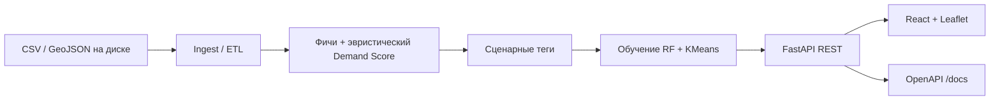

# Архитектура

## Компоненты

1. **Ingest** — загрузка `dataset_final.csv`, справочников POI, приоритетных зон; привязка H3→lat/lon→условный округ (ближайшая точка из `moscow_okrugs_demographics.geojson`).
2. **Эвристика** — Demand Score по весам из `scenario_analysis.html` (min-max нормировка по всему датасету).
3. **Сценарии** — теги `white_spots`, `competitor`, `growth_retail`, `low_utilization` (часть сигналов — прокси из-за отсутствия временных рядов в `dataset_final.csv`).
4. **Supervised ML** — `RandomForestClassifier` на псевдо-метках из правил; при сбое вероятности — fallback на `RandomForestRegressor` к `heuristic_score`.
5. **Unsupervised** — `KMeans` по масштабированным числовым признакам → `cluster_id`.
6. **Explain** — локальное объяснение: замена признака на медиану и измерение изменения скоринга.
7. **UI** — полигоны H3 на карте OSM, фильтры сценария, кнопка текстовой суммаризации.

## Поток запроса `/zones`

1. Фильтрация `pandas` по сценарию, bbox, порогам.
2. Сортировка по `ml_score`, обрезка `limit`.
3. Сборка GeoJSON полигонов через `h3.cell_to_boundary`.
